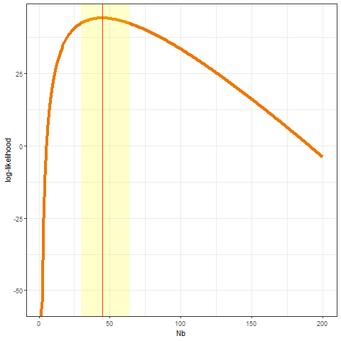

```{r, include = FALSE}
knitr::opts_chunk$set(
  collapse = TRUE,
  comment = "#>"
)
```

```{r setup,include=FALSE}
library(ViralBottleneck)
library(knitr)
knitr::opts_chunk$set(echo = TRUE)
```

This package is used for estimating viral transmission bottleneck sizes using different methods.

## 1. Install package and download test dataset

First step, install the package "ViralBottleneck" and download dataset in test_dataset folder

## 2. Create transmission object

Second step, the transmission object need to be created before bottleneck size estimation. To create transmission object, the working directory need to meet two requirements: transmission pairs table and sample files used for estimation. This package would extract sample files according to the transmission pairs table the users input.

The example of the transmission pairs table is below (in `test_dataset` folder in package)

```{r, echo=FALSE}
data("Example_TansmissionPairs")
kable(Example_TansmissionPairs)


```

Note: Do not put the "-" in name of sample.

After making sure the sample files all exist according to the transmission pairs, start to create transmission object. example code:

```{r,results='hide',eval = FALSE}
H1N1_t = read.table("Example_TansmissionPairs.csv",header = TRUE,sep = ",")
H1N1_ob = CreateTransmissionObject(H1N1_t)
```

**2.1 Subset transmission object**

The transmission object could be used as list.

```{r,results='hide',eval = FALSE}
#Get first 3 transmission object
H1N1_ob_subset = H1N1_ob[1:2]
```

## 3. Summary transmission object

After creating transmission object, the `Summary_ob` function would provide the information of shared sites (the sites belong to shared sites should be sequenced both in donor and recipient.) for users. Example code:

```{r,results='hide',eval = FALSE}
Summary_H1N1 = Summary_ob(H1N1_ob)
```

The result:

```{r, echo=FALSE}
data("Example_summaryOutput")
kable(Example_summaryOutput)
```

## 4. Transmission bottleneck size estimation

Finally, start to calculate transmission bottleneck size using transmission object.

**4.1 Output of** `Bottleneck_size_Calculation` **function**

Take calculation using Beta-binomial method approximate version as an example:

```{r,results='hide',eval = FALSE,tidy=FALSE}
BB_App_output = 
  Bottleneck_size_Calculation(
           transmission_ob = H1N1_ob,
           method ="Beta_binomial_Approximate",
           error_calling = 0,
           variant_calling = 0.03,
           Nbmin = 1,
           Nbmax = 200,
           donor_depth_threshold = 0,
           recipient_depth_threshold = 0 
           )
```

Output like:

```{r,echo=FALSE}
data("Example_output")
kable(Example_output)
```

**4.2 Specify transmission pairs during estimation**

This package provide a chance that if user need to specify some transmission pairs for estimation

```{r,results='hide',eval = FALSE}
subset_transmission_pairs = read.table("H1N1_transmission_pairs_specify.csv",header = TRUE,sep = ",")
```

**4.3 Calculation**

`Bottleneck_size_Calculation` could create plot of likelihood curve for each transmission pairs in working directory. However, this argument just used for the methods using maximum likelihoods estimation, including `KL` method, `Presence-Absence` method, `Binomial` method, `Beta_binomial_Approximate` method and `Beta_binomial_Exact` method (method details: link). Using `show_table` and `plot` options could help to save output and obtain the plots of likelihood curve for each transmission pairs.

The program would create individual folder for each transmission pair to store the plot. Example code for creating plot:

```{r,results='hide',eval = FALSE,tidy=FALSE}
 BB_App_output_log =  
            Bottleneck_size_Calculation(
            transmission_ob = H1N1_ob,                          
            method = "Beta_binomial_Approximate",
            error_calling = 0,
            variant_calling = 0.03,
            Nbmin = 1,
            Nbmax = 200,
            donor_depth_threshold = 0,
            recipient_depth_threshold = 0,
            show_table = FALSE,
            plot= TRUE 
            )
```

The plot of likelihood curve for one transmission pairs (donor_3000-50_3_All_r1) is below:


{width="50%"}

**4.4 Log file**

`Bottleneck_size_Calculation` could create log file containing number of variant sites used in calculation and number of variant sites filtered before calculation in working directory.

Example code:

```{r,results='hide',eval = FALSE,tidy=FALSE}
 BB_App_output_log =  
            Bottleneck_size_Calculation(
            transmission_ob = H1N1_ob,                          
            method = "Beta_binomial_Approximate",
            error_calling = 0,
            variant_calling = 0.03,
            Nbmin = 1,
            Nbmax = 200,
            donor_depth_threshold = 0,
            recipient_depth_threshold = 0,
            log= TRUE 
            )

```

Output of `log` argument:

```{r,echo=FALSE}
data("Example_log")
kable(Example_log)
```
